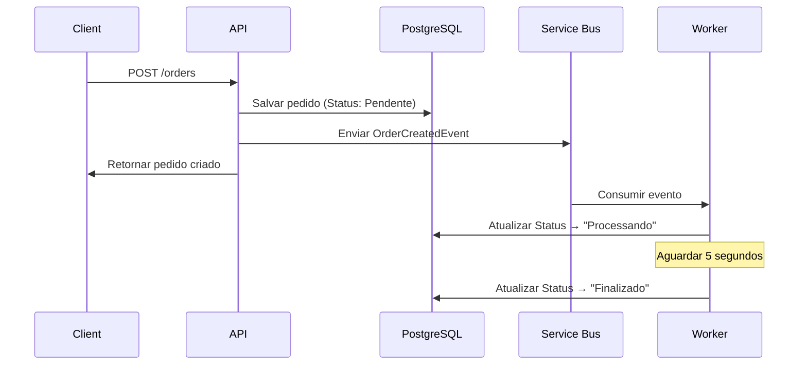

# 🚀 Order Management System - Backend API

Sistema de gestão de pedidos desenvolvido com .NET 7, implementando arquitetura limpa com processamento assíncrono via Azure Service Bus e persistência em PostgreSQL.


## 🎯 Visão Geral

API REST robusta para gestão de pedidos com processamento assíncrono de mensagens. A arquitetura segue os princípios SOLID e Clean Architecture, garantindo alta manutenibilidade, testabilidade e escalabilidade.

### ✨ Funcionalidades Implementadas

- ✅ **API REST Completa**: CRUD completo com endpoints documentados via Swagger
- ✅ **Processamento Assíncrono**: Worker service para processamento via Azure Service Bus
- ✅ **Arquitetura Limpa**: Separação em camadas (Core, Infrastructure, API, Worker)
- ✅ **Persistência Robusta**: Entity Framework Core com PostgreSQL
- ✅ **Logs Estruturados**: Logging detalhado para monitoramento
- ✅ **Validação**: Data Annotations e tratamento de erros

## 🏗️ Arquitetura

```
┌─────────────────┐    ┌─────────────────┐    ┌─────────────────┐
│   Frontend      │    │   Backend API   │    │ Worker Service  │
│   (React)       │◄──►│   (.NET 7)      │    │   (.NET 7)      │
└─────────────────┘    └─────────────────┘    └─────────────────┘
                              │                        │
                              ▼                        ▼
                    ┌─────────────────┐    ┌─────────────────┐
                    │   PostgreSQL    │    │ Azure Service   │
                    │   Database      │    │     Bus         │
                    └─────────────────┘    └─────────────────┘
```

### 📁 Estrutura do Projeto

```
OrderManagementSystem/
├── 🎯 OrderManagement.Api/          # Controllers, DTOs, Program.cs
│   ├── Controllers/                 # Endpoints REST
│   ├── DTOs/                       # Data Transfer Objects
│   └── Program.cs                  # Configuração da API
├── ⚙️ OrderManagement.Worker/       # Background service
│   ├── Services/                   # Processamento assíncrono
│   └── Program.cs                  # Configuração do Worker
├── 📚 OrderManagement.Core/         # Domínio e contratos
│   ├── Entities/                   # Entidades de domínio
│   ├── Interfaces/                 # Contratos
│   └── Events/                     # Eventos de domínio
├── 🔧 OrderManagement.Infrastructure/ # Implementações
│   ├── Data/                       # DbContext
│   ├── Repositories/               # Implementação dos repositórios
│   └── Services/                   # Implementação dos serviços
└── 🐳 docker-compose.yml           # Orquestração de containers
```

## 🚀 Tecnologias Utilizadas

- **.NET 7**: Framework principal
- **Entity Framework Core 7**: ORM para PostgreSQL
- **Azure Service Bus**: Mensageria assíncrona
- **PostgreSQL 15**: Banco de dados relacional
- **Docker & Docker Compose**: Containerização
- **Swagger/OpenAPI**: Documentação automática da API
- **Serilog**: Logging estruturado (opcional)

## 📋 Pré-requisitos

### Desenvolvimento Local (WSL2/Linux)

```bash
# Softwares obrigatórios
- .NET 7 SDK ou superior
- Docker Desktop com integração WSL2
- Git
- Conta Azure (para Service Bus)
```

### Verificação de Instalação

```bash
# Verificar .NET
dotnet --version
# Esperado: 7.0.x ou superior

# Verificar Docker
docker --version
docker-compose --version
```

## ⚡ Início Rápido

### 1. Clone o Repositório

```bash
git clone https://github.com/seu-usuario/order-management-backend.git
cd order-management-backend
```

### 2. Configuração do Azure Service Bus

1. Acesse o [Azure Portal](https://portal.azure.com)
2. Crie um **Service Bus Namespace**
3. Crie uma **Queue** chamada `order-created`
4. Copie a **Connection String**

### 3. Configurar appsettings.json

```json
{
  "ConnectionStrings": {
    "DefaultConnection": "Host=localhost;Database=orderdb;Username=postgres;Password=postgres",
    "ServiceBus": "Endpoint=sb://your-namespace.servicebus.windows.net/;SharedAccessKeyName=RootManageSharedAccessKey;SharedAccessKey=your-key"
  },
  "Logging": {
    "LogLevel": {
      "Default": "Information",
      "Microsoft.AspNetCore": "Warning"
    }
  },
  "AllowedHosts": "*"
}
```

### 4. Executar Localmente (Desenvolvimento)

**Acesse:**
- 🔌 API: http://localhost:5004
- 📖 Swagger: http://localhost:5004/swagger

```bash
# Restaurar dependências
dotnet restore

# Subir PostgreSQL
docker run --name postgres \
  -e POSTGRES_DB=orderdb \
  -e POSTGRES_USER=postgres \
  -e POSTGRES_PASSWORD=postgres \
  -p 5432:5432 \
  -d postgres:15

# Executar API
cd OrderManagement.Api
dotnet run

# Executar Worker (novo terminal)
cd ../OrderManagement.Worker
dotnet run
```

## 📊 Endpoints da API

### Pedidos

|    Método    |      Endpoint      |       Descrição       |    Implementado    |
|--------------|--------------------|-----------------------|------------------- |
|    `POST`    | `/api/orders`      | Criar pedido          |        ✅         |
|    `GET`     | `/api/orders`      | Listar pedidos        |        ✅         |
|    `GET`     | `/api/orders/{id}` | Obter pedido por ID   |        ✅         |
|   `DELETE`   | `/api/orders/{id}` | Deletar pedido        |        ✅         |

### Modelo de Dados

```csharp
public class Order
{
    public Guid Id { get; set; }            // Identificador único
    public string Cliente { get; set; }     // Nome do cliente
    public string Produto { get; set; }     // Nome do produto
    public decimal Valor { get; set; }      // Valor do pedido
    public string Status { get; set; }      // Pendente, Processando, Finalizado
    public DateTime DataCriacao { get; set; } // Data de criação
}
```

### Exemplo de Requisição

```json
POST /api/orders
Content-Type: application/json

{
  "cliente": "João Silva",
  "produto": "Notebook Dell Inspiron",
  "valor": 2500.99
}
```

### Exemplo de Resposta

```json
HTTP/1.1 201 Created
Location: /api/orders/3fa85f64-5717-4562-b3fc-2c963f66afa6

{
  "id": "3fa85f64-5717-4562-b3fc-2c963f66afa6",
  "cliente": "João Silva",
  "produto": "Notebook Dell Inspiron",
  "valor": 2500.99,
  "status": "Pendente",
  "dataCriacao": "2024-03-15T10:30:00Z"
}
```

## 🔄 Fluxo de Processamento



### Estados do Pedido

1. **Pendente**: Estado inicial após criação
2. **Processando**: Worker iniciou o processamento (imediato)
3. **Finalizado**: Processamento concluído (após 5 segundos)

## 🧪 Testes

### Testes com cURL

```bash
# Criar pedido
curl -X POST http://localhost:5004/api/orders \
  -H "Content-Type: application/json" \
  -d '{
    "cliente": "Teste API",
    "produto": "Produto Teste",
    "valor": 99.99
  }'

# Listar todos os pedidos
curl http://localhost:5004/api/orders

# Obter pedido específico
curl http://localhost:5004/api/orders/{id}

# Deletar pedido
curl -X DELETE http://localhost:5004/api/orders/{id}
```

### Executar Testes Unitários

```bash
# Executar todos os testes
dotnet test

# Executar com cobertura
dotnet test --collect:"XPlat Code Coverage"
```

## 🐳 Docker

### Serviços Inclusos

- **api**: API .NET na porta 5004
- **worker**: Processador de mensagens em background
- **postgres**: Banco PostgreSQL na porta 5432

### Comandos Úteis

```bash
# Ver logs da API
docker-compose logs -f api

# Ver logs do Worker
docker-compose logs -f worker

# Ver logs do PostgreSQL
docker-compose logs -f postgres

# Rebuild específico
docker-compose up --build api

# Parar serviços
docker-compose down

# Limpar volumes (CUIDADO: apaga dados)
docker-compose down -v
```

### Dockerfile da API

```dockerfile
FROM mcr.microsoft.com/dotnet/aspnet:7.0 AS base
WORKDIR /app
EXPOSE 80

FROM mcr.microsoft.com/dotnet/sdk:7.0 AS build
WORKDIR /src
COPY ["OrderManagement.Api/OrderManagement.Api.csproj", "OrderManagement.Api/"]
COPY ["OrderManagement.Core/OrderManagement.Core.csproj", "OrderManagement.Core/"]
COPY ["OrderManagement.Infrastructure/OrderManagement.Infrastructure.csproj", "OrderManagement.Infrastructure/"]

RUN dotnet restore "OrderManagement.Api/OrderManagement.Api.csproj"
COPY . .
WORKDIR "/src/OrderManagement.Api"
RUN dotnet build "OrderManagement.Api.csproj" -c Release -o /app/build

FROM build AS publish
RUN dotnet publish "OrderManagement.Api.csproj" -c Release -o /app/publish

FROM base AS final
WORKDIR /app
COPY --from=publish /app/publish .
ENTRYPOINT ["dotnet", "OrderManagement.Api.dll"]
```

## 🔍 Logs e Monitoramento

### Logs Estruturados

```csharp
// Exemplos de logs implementados
_logger.LogInformation("Order {OrderId} created successfully", order.Id);
_logger.LogInformation("Order {OrderId} status updated to {Status}", order.Id, order.Status);
_logger.LogError(ex, "Error processing order {OrderId}", orderEvent.OrderId);
```

## 🛡️ Segurança e Validação

### Validações Implementadas

```csharp
[Required]
[StringLength(100)]
public string Cliente { get; set; }

[Range(0.01, double.MaxValue, ErrorMessage = "O valor deve ser maior que zero")]
public decimal Valor { get; set; }
```

### Tratamento de Erros

- **400 Bad Request**: Dados inválidos
- **404 Not Found**: Recurso não encontrado
- **500 Internal Server Error**: Erro interno (logado)

## 🔧 Configurações de Desenvolvimento

### appsettings.Development.json

```json
{
  "ConnectionStrings": {
    "DefaultConnection": "Host=localhost;Database=orderdb_dev;Username=postgres;Password=postgres"
  },
  "Logging": {
    "LogLevel": {
      "Default": "Debug",
      "System": "Information",
      "Microsoft": "Information"
    }
  }
}
```

### Variáveis de Ambiente

```bash
# Para desenvolvimento
export ASPNETCORE_ENVIRONMENT=Development
export ASPNETCORE_URLS="http://0.0.0.0:5004"

# Para produção
export ASPNETCORE_ENVIRONMENT=Production
```

## 🚀 Deploy e Produção

### Preparação para Deploy

1. **Configurar connection strings de produção**
2. **Configurar Azure Service Bus produção**
3. **Build das imagens Docker**
4. **Configurar variáveis de ambiente**

### Azure Container Instances

```bash
# Build e push da imagem
docker build -t orderapi:latest -f OrderManagement.Api/Dockerfile .
docker tag orderapi:latest myregistry.azurecr.io/orderapi:latest
docker push myregistry.azurecr.io/orderapi:latest
```

## 🛠️ Troubleshooting

### Problemas Comuns

**PostgreSQL não conecta:**
```bash
# Verificar se container está rodando
docker ps | grep postgres

# Ver logs do PostgreSQL
docker logs postgres

# Testar conexão
docker exec -it postgres psql -U postgres -d orderdb
```

**Azure Service Bus erro:**
- Verificar connection string no appsettings.json
- Confirmar se a queue "order-created" existe
- Verificar permissões no Azure Portal

**API não inicia:**
```bash
# Ver logs detalhados
dotnet run --verbosity detailed

# Verificar porta em uso
sudo netstat -tulpn | grep :5004
```

**Worker não processa mensagens:**
- Verificar logs do worker: `docker-compose logs -f worker`
- Confirmar connection string do Service Bus
- Verificar se a queue tem mensagens no Azure Portal

### Padrões de Commit

```bash
feat: adicionar novo endpoint
fix: corrigir bug no processamento
docs: atualizar documentação
refactor: melhorar estrutura do código
test: adicionar testes unitários
```

Desenvolvido por Diego Carneiro.
